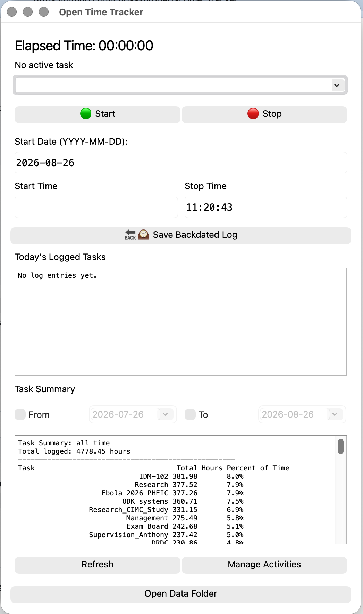
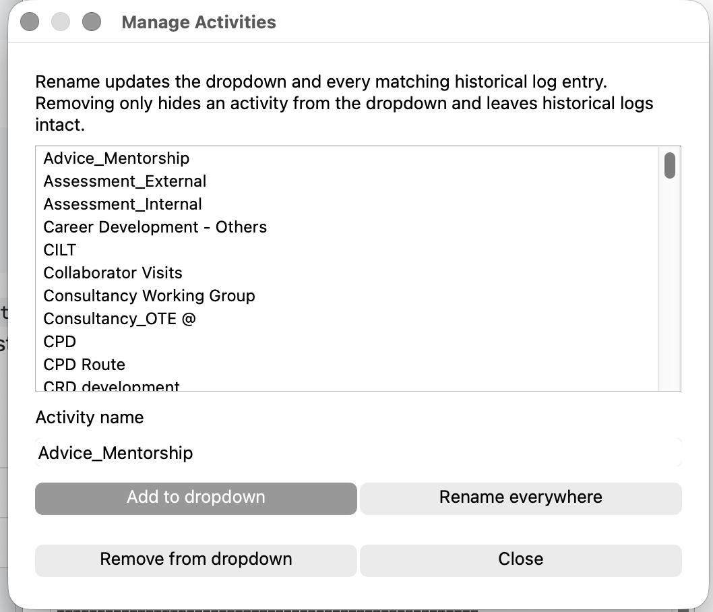

# Open Time Tracker

A small, local-first desktop time tracker for macOS and Windows.

Open Time Tracker is designed for people who want a very simple way to record what they are working on, keep the underlying data in ordinary CSV files, and get useful summaries without creating an account or sending data to a server.

It supports both live timing and retrospective entry, including a full 24-hour weekly calendar for visually filling gaps in the log.



## How to use

### 1. Start tracking a task

Choose an activity from the dropdown, or type a new activity name, then click **🟢 Start**.

The app records the start date and time and shows the elapsed time while the task is active.

When you finish, click **🔴 Stop**. The completed session is appended to `time_log.csv`.

If you start a different task while another task is active, the current task is closed first and the new task begins.

### 2. Add a backdated entry

You can record work that was not timed live.

1. Choose or type the activity.
2. Enter the **Start Date**.
3. Enter the **Start Time**.
4. Enter the **Stop Time**.
5. Click **Save Backdated Log**.

Times use `HH:MM:SS`; dates use `YYYY-MM-DD`.

The Stop Time normally updates automatically to the current time, but you can type over it when entering a historical record.

### 3. See what you have logged today

The **Today's Logged Tasks** panel shows the most recent sessions that started today.

Click **Refresh** whenever you want to reload the activity list and displays from disk.

### 4. Get a summary for any period

The **Task Summary** panel totals your logged time by activity and shows each activity's percentage of the selected period.

By default, the summary is **all time**.

Use the date controls to answer questions such as:

- *How much time have I spent on this project since 12 October?* — tick **From** and choose 12 October.
- *How much did I work on this between 1 January and 15 February?* — tick **From** and **To** and choose both dates.
- *How much had I logged up to a particular date?* — tick **To** only.

Date ranges are inclusive and are based on the start date of each logged session.

### 5. Manage activity names

Click **Manage Activities** to maintain the activity list.



From here you can:

- **Add to dropdown** — create a new activity.
- **Rename everywhere** — rename an activity in both the dropdown and all matching historical log entries.
- **Merge activities** — rename one activity to an existing activity name; their historical totals will then be combined.
- **Remove from dropdown** — stop showing an activity in the dropdown without deleting its historical records.

Retrospective renaming creates timestamped backups before modifying your CSV files.

### 6. Use the weekly calendar for retrospective entry

Click **Show Calendar** to expand a 24-hour Monday-to-Sunday week view beside the main tracker.

The calendar is designed for retrospective entry and makes missing periods immediately visible.

- Every day shows the full **00:00–24:00** period.
- Existing logs are drawn at their actual times.
- Overnight work appears across the relevant day boundaries.
- Use **‹**, **›** and **Today** to move between weeks.
- Drag over an empty period to create a new retrospective entry.
- Times snap to 15-minute intervals.
- After releasing the drag, choose or type the activity and save it.

The calendar writes to the same `time_log.csv` as the normal timer and backdated-entry form.

### 7. Open the underlying data

Click **Open Data Folder** to open the application's data directory in Finder or Explorer.

The data remain ordinary CSV files and can be inspected, backed up, analysed or edited independently of the application.

---

## Download

Download the latest packaged version from the repository's **Releases** page.

Release builds are produced automatically for:

- **macOS Apple Silicon (arm64)** — `OpenTimeTracker-macOS-arm64.zip`
- **Windows x64** — `OpenTimeTracker.exe`

Python is bundled into both builds, so users do **not** need to install Python separately.

### macOS security note

The current macOS build is ad-hoc signed but is not yet Apple Developer ID notarised. macOS may therefore display a Gatekeeper warning when opening a downloaded release for the first time.

### Windows security note

The Windows executable is not currently Authenticode signed, so Windows SmartScreen may warn about a newly downloaded build.

---

## Data storage

Open Time Tracker is deliberately **local-first**. There is no cloud account, remote database, sync service or subscription.

### macOS

```text
~/Library/Application Support/OpenTimeTracker/
├── activities.csv
├── time_log.csv
└── backups/
```

### Windows

```text
%APPDATA%\OpenTimeTracker\
├── activities.csv
├── time_log.csv
└── backups\
```

On first run, packaged versions attempt to migrate `activities.csv` and `time_log.csv` from locations used by older versions of the app.

The **Open Data Folder** button takes you directly to the appropriate directory.

### `time_log.csv`

Each completed session is stored as one row:

| StartTime | EndTime | Duration | Task |
|---|---|---|---|
| 2026-01-12 09:00:00 | 2026-01-12 10:15:00 | 01:15:00 | Research |
| 2026-01-12 10:30:00 | 2026-01-12 11:00:00 | 00:30:00 | Teaching |

### `activities.csv`

This contains the activity names shown in the dropdown. Historical task names can exist in `time_log.csv` even if they have been removed from the dropdown.

### Backups

Before a retrospective rename modifies persistent data, timestamped copies are written to:

```text
OpenTimeTracker/backups/
```

Removing an activity from the dropdown does **not** alter historical records.

---

## Features

- Start/stop task timing
- Real-time elapsed time display
- Editable activity dropdown
- Automatic addition of newly typed activities
- Backdated log entries
- Manual start-time adjustment
- Today's recent log display
- All-time task summaries
- Optional summary start and/or end dates
- Total hours and percentage-of-time summaries
- Activity management interface
- Retrospective activity renaming
- Activity merging
- Automatic backups before historical renames
- Direct access to the data folder
- Expandable 24-hour Monday-Sunday calendar
- Drag-to-create retrospective calendar entries
- Week navigation and current-week jump
- Overnight work visualisation across day boundaries
- Local CSV storage
- Native Apple Silicon macOS packaging
- Standalone Windows x64 packaging
- Automatic cross-platform builds with GitHub Actions

---

## Version history

### v1.4.0

- Added an expandable **24-hour weekly calendar** beside the main tracker.
- Monday-Sunday columns show real dates for the selected week.
- Existing time logs are rendered as calendar blocks at their recorded times.
- Overnight work is displayed across the appropriate day boundaries.
- Added previous-week, next-week and **Today** navigation.
- Added drag-to-create retrospective entries directly from the calendar.
- Calendar selections snap to 15-minute intervals.
- New calendar entries use the existing activity list and write to the same `time_log.csv`.
- Calendar and summary views refresh automatically after saving.

### v1.3.1

- Fixed a crash in the **Manage Activities** interface under the newer PyQt/Python build.
- Activity-management errors are now contained and shown as dialogs instead of terminating the application.

### v1.3.0

Major data-management and packaging update:

- Added **Open Data Folder**.
- Added **Manage Activities**.
- Added retrospective renaming and merging of historical activity names.
- Added automatic backups before historical edits.
- Added optional start/end date filters for summaries.
- Added total logged hours to summaries.
- Moved packaged application data into the normal per-user application-data directory.
- Added native Apple Silicon and Windows x64 release builds.
- Added automatic GitHub Actions builds and tagged releases.

### v1.1.x

- Added backdated entries.
- Added real-time elapsed time.
- Added editable start times.
- Added auto-updating Stop Time with manual override.
- Improved daily-log and summary displays.

### v1.0.0

- Initial start/stop time tracker.
- CSV logging.
- Daily logs and summary statistics.
- Editable task list.

---

## Running from source

The packaged releases are the easiest way to use the application. For development, clone the repository and install the Python dependencies.

```bash
python -m venv .venv
source .venv/bin/activate       # macOS/Linux
# .venv\Scripts\activate        # Windows

python -m pip install -r requirements.txt
python time_tracker.py
```

The current reproducible build targets Python 3.14.7.

---

## Building locally

Install the build dependencies:

```bash
python -m pip install -r requirements-build.txt
```

### Apple Silicon macOS

Run from an arm64 Python environment:

```bash
python -m PyInstaller \
  --noconfirm \
  --clean \
  --windowed \
  --name OpenTimeTracker \
  --add-data "activities.csv:." \
  time_tracker.py
```

The result is:

```text
dist/OpenTimeTracker.app
```

### Windows x64

```powershell
python -m PyInstaller `
  --noconfirm `
  --clean `
  --onefile `
  --windowed `
  --name OpenTimeTracker `
  --add-data "activities.csv:." `
  time_tracker.py
```

The result is:

```text
dist/OpenTimeTracker.exe
```

---

## Automated builds and releases

The GitHub Actions workflow builds both supported platforms whenever changes are pushed to `main`.

Normal `main` builds are available as workflow artifacts.

Pushing a version tag creates a GitHub Release and attaches both packaged applications automatically:

```bash
git tag v1.3.1
git push origin v1.3.1
```

The workflow produces:

```text
OpenTimeTracker-macOS-arm64.zip
OpenTimeTracker.exe
```

---

## Repository structure

```text
.
├── .github/
│   └── workflows/
│       └── build.yml
├── docs/
│   └── screenshots/
│       ├── main-window.png
│       └── manage-activities.png
├── activities.csv
├── requirements.txt
├── requirements-build.txt
├── time_tracker.py
└── README.md
```

---

## Technology

Current packaged builds use:

- Python 3.14.7
- pandas
- PyQt5
- PyInstaller

The macOS workflow verifies that the generated application is native `arm64`.

---

## License

This project is licensed under the MIT License.
